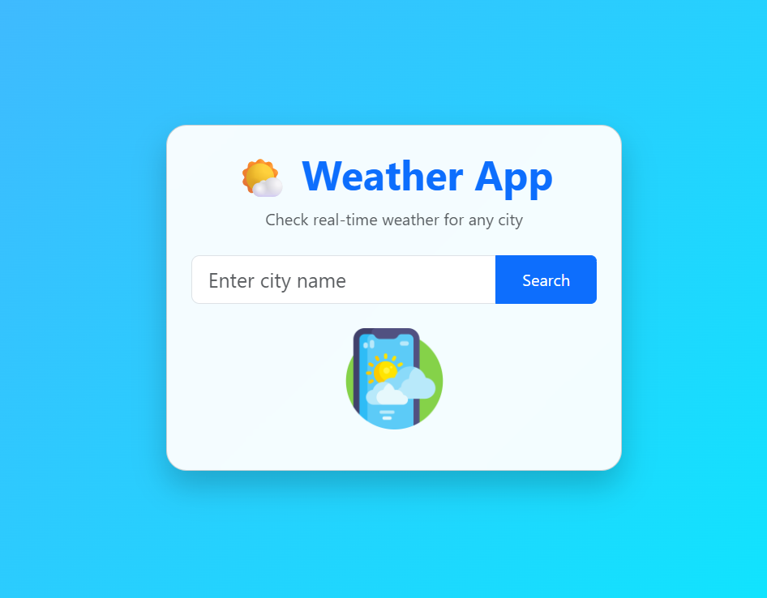

# Weather App

A responsive weather application built using HTML, JavaScript, Bootstrap, and OpenWeather API.

## Features

- Search weather by city name
- Real-time temperature
- Weather description
- Dynamic weather icons
- Responsive design

## Technologies Used

- HTML5
- CSS3
- Bootstrap 5
- JavaScript (ES6)
- OpenWeather API

## Screenshot

## Future Improvements

- 5-Day Forecast
- Current Location Weather
- Dark Mode
- Search History
